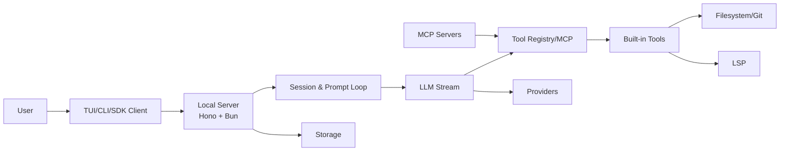
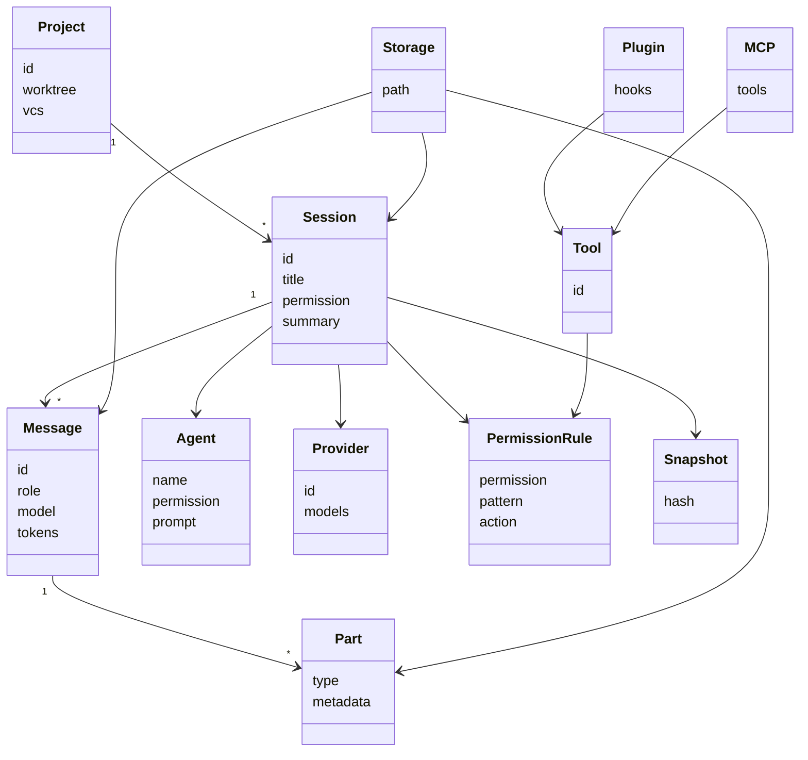
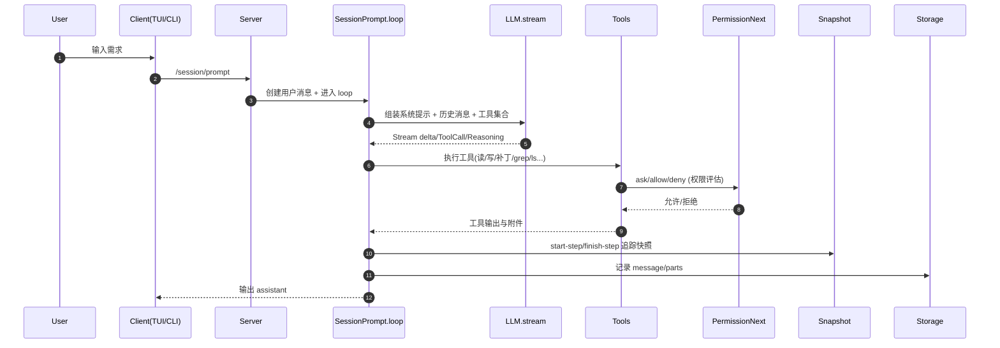
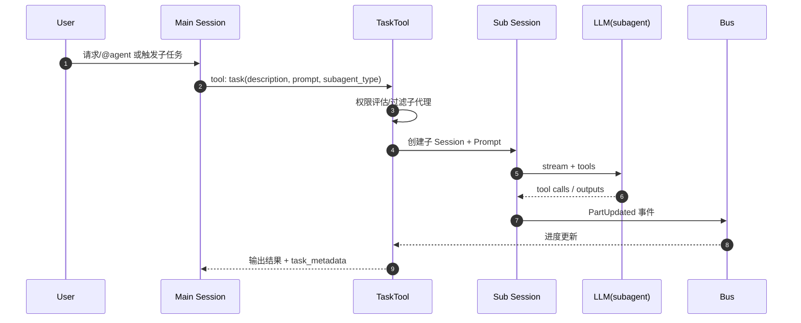
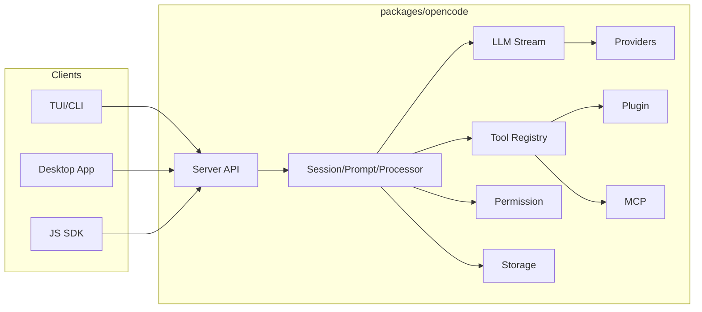
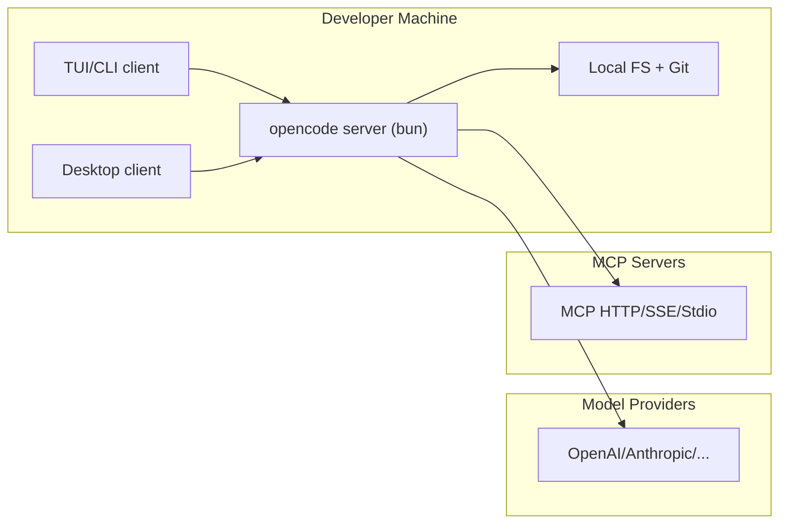

# OpenCode 详细设计文档（4+1 视图）

版本: 1.0  
日期: 2026-01-28  
范围: 本文描述 OpenCode（本仓库）核心架构与自动编写代码机制，面向系统架构师与核心开发者。

---

## 0. 目标与约束

- 目标
  - 明确 OpenCode 的核心运行机制、模块职责与边界。
  - 解释自动编写代码的端到端实现路径、关键算法与扩展点。
  - 提供 4+1 视图，覆盖逻辑、过程、开发、物理与场景视角。
- 约束与现状
  - 以当前仓库实现为准，关键实现位于 `packages/opencode`.
  - 核心交互通过本地 Server（Hono/Bun）提供 API，TUI/客户端作为前端消费。实现入口见 `packages/opencode/src/server/server.ts`.

---

## 1. 架构概览

OpenCode 采用“本地 Server + 多客户端 + 可插拔工具与模型提供方”的架构：

- **Server**：统一对外 API、路由、权限、会话、工具与 LLM 编排。`packages/opencode/src/server/server.ts`
- **Session/LLM**：会话循环、消息/工具流式处理、上下文构建。`packages/opencode/src/session/*`
- **Tools**：文件/命令/检索/补丁等工具统一注册与调用。`packages/opencode/src/tool/*`
- **Providers**：多模型提供方适配、鉴权与参数归一。`packages/opencode/src/provider/*`
- **Plugin & MCP**：插件机制与 MCP 工具动态接入。`packages/opencode/src/plugin/index.ts`, `packages/opencode/src/mcp/index.ts`

高层交互图：



---

## 2. 逻辑视图（Logical View）

### 2.1 领域对象

核心对象与关系（对应 `packages/opencode/src/session/message-v2.ts`, `packages/opencode/src/session/index.ts`）：

- **Project**：工作区根、VCS 类型与路径。
- **Session**：会话元数据、权限规则、摘要、版本、时间。
- **Message**：用户/助手消息，携带模型、token、cost、状态。
- **Part**：消息片段（文本、工具、文件、推理、快照、任务等）。
- **Agent**：权限与提示词配置，支持 build/plan/general 等模式。`packages/opencode/src/agent/agent.ts`
- **Tool**：统一工具接口与注册。`packages/opencode/src/tool/tool.ts`, `packages/opencode/src/tool/registry.ts`
- **Provider/Model**：模型与供应商配置、鉴权、参数变换。`packages/opencode/src/provider/provider.ts`
- **Permission**：规则集评估与审批。`packages/opencode/src/permission/next.ts`
- **Snapshot**：基于 git 的快照与差异回退。`packages/opencode/src/snapshot/index.ts`
- **Storage**：本地 JSON 存储与迁移。`packages/opencode/src/storage/storage.ts`

### 2.2 类关系图



---

## 3. 过程视图（Process View）

### 3.1 自动编写代码主流程（关键链路）

以下序列展示 “用户请求 -> 自动编写代码 -> 结果返回” 的完整过程：



### 3.2 会话循环与多步执行

核心流程位于 `packages/opencode/src/session/prompt.ts`：

- **loop()** 持续处理会话直到完成：
  - 判断是否需要继续（上一次 assistant 是否已完成）
  - 处理 **subtask** / **compaction** 任务片段
  - 判断上下文是否溢出并触发压缩 `SessionCompaction`
  - 创建新的 assistant message 并调用 `SessionProcessor`
  - 处理结束后进行 prune 与回调收敛

### 3.3 流式处理与工具调用

`SessionProcessor` 在 `packages/opencode/src/session/processor.ts` 中完成以下关键逻辑：

- 解析 **reasoning-start/delta/end** 并写入消息 part
- 解析 **tool-call / tool-result / tool-error**
  - 触发权限校验
  - 处理工具结果与附件
  - 失败时标记并可中断 loop
- **doom-loop 检测**：相同工具调用重复 3 次时请求额外权限（防止死循环）
- **start-step / finish-step**：驱动 Snapshot 快照追踪

### 3.4 上下文压缩

`SessionCompaction` 在 `packages/opencode/src/session/compaction.ts` 中负责：

- 根据模型上下文限制判断是否溢出
- 通过专用 agent 生成“续写提示”
- 可自动插入“Continue” synthetic user 消息以触发后续步骤
- 对旧工具输出进行 prune，降低 token 压力

### 3.5 多 Agent 编排与详细工作流

OpenCode 的多 Agent 主要由 **TaskTool + 子 Session** 驱动，编排逻辑集中在 `packages/opencode/src/tool/task.ts` 与 `packages/opencode/src/session/prompt.ts`。

**Agent 角色与模式**

- **Primary（主代理）**：`build`、`plan`（默认工作模式与只读模式）
- **Subagent（子代理）**：`general`、`explore`（用于并行探索与复杂任务分解）
- **Internal（内部代理）**：`compaction`、`title`、`summary`（不可见、仅系统流程）

**触发方式**

1. 用户显式 `@agent`：`SessionPrompt.resolvePromptParts()` 会解析出 `AgentPart`，并在 loop 中设置 `bypassAgentCheck`，跳过 TaskTool 的权限询问。
2. LLM 主动调用 `task` 工具：由模型决定把子任务拆给子代理。
3. 队列子任务（SubtaskPart）：`SessionPrompt.loop()` 优先消费 `SubtaskPart`，直接执行 TaskTool。

**工作流步骤**

1. **可用子代理过滤**  
   `TaskTool` 获取所有非 primary agent，并用 `PermissionNext.evaluate("task", agentName, caller.permission)` 过滤出可用子代理。
2. **权限评估**  
   若非用户显式调用（`bypassAgentCheck` 为 false），则 `PermissionNext.ask` 触发授权，支持一次/永久允许。
3. **创建子 Session**  
   `Session.create({ parentID })` 创建子会话，默认禁用 `todowrite/todoread` 与 `task`，并按配置允许少量主工具。
4. **模型与提示构建**  
   子代理使用自身 model（若配置）或继承主会话模型；`SessionPrompt.resolvePromptParts()` 支持文件/目录引用。
5. **执行与进度回传**  
   `TaskTool` 订阅 `Bus` 的 `PartUpdated`，将子会话工具执行进度摘要回写到父调用元数据中。
6. **输出聚合**  
   子会话最后的文本 + `<task_metadata>`（含 sessionId）返回到父会话，主流程继续。

**多 Agent 编排序列图**



---

## 4. 开发视图（Development View）

### 4.1 代码结构与分层

- `packages/opencode`：核心引擎与 server（Session/LLM/Tool/Provider/Permission/Storage）
- `packages/sdk/js`：JS SDK 与 API 客户端
- `packages/desktop`：桌面客户端
- `sdks/vscode`：VSCode 扩展
- `packages/web` / `packages/console`：Web/Console 相关

### 4.2 组件关系图



### 4.3 关键模块映射

- 会话/消息模型：`packages/opencode/src/session/*`
- 自动编写代码主流程：`packages/opencode/src/session/prompt.ts`
- 流式处理与工具事件：`packages/opencode/src/session/processor.ts`
- 工具系统：`packages/opencode/src/tool/*`
- 权限系统：`packages/opencode/src/permission/next.ts`
- 快照与回滚：`packages/opencode/src/snapshot/index.ts`
- 插件/扩展：`packages/opencode/src/plugin/index.ts`
- MCP 集成：`packages/opencode/src/mcp/index.ts`
- Provider 适配：`packages/opencode/src/provider/provider.ts`
- 本地存储：`packages/opencode/src/storage/storage.ts`

### 4.4 技术栈与作用（结合项目用法）

#### 4.4.1 核心引擎与协议

| 技术栈 | 作用 | 在项目中的用法/落点 |
| --- | --- | --- |
| **Bun** | 运行时、文件与子进程工具链 | `Bun.file`, `Bun.Glob`, `Bun.$` 用于存储/快照/工具执行（`storage`, `snapshot`, `tool/*`） |
| **TypeScript** | 全量类型与工程组织 | `packages/opencode/src/**` 全部模块 |
| **Hono** | 轻量 HTTP Server / 路由 | `packages/opencode/src/server/server.ts` 与 `routes/*` |
| **hono-openapi** | OpenAPI 描述与校验 | 路由 schema 与 `/doc` 文档 |
| **AI SDK (ai)** | LLM 流式调用与工具协议 | `LLM.stream`, `tool`, `jsonSchema`（`session/llm.ts`, `session/prompt.ts`） |
| **Zod** | Schema 定义与校验 | 消息/权限/配置 schema（`session/message-v2.ts`, `permission/next.ts`） |
| **MCP SDK** | 模型上下文协议工具接入 | `packages/opencode/src/mcp/index.ts` |
| **Agent Client Protocol** | 代理编排能力 | `packages/opencode/src/acp/*` |
| **LSP / JSON-RPC** | 代码符号与编辑辅助 | `packages/opencode/src/lsp/*`, 依赖 `vscode-jsonrpc` |
| **tree-sitter (bash)** | 命令解析与权限推断 | `packages/opencode/src/tool/bash.ts` |
| **bun-pty** | 伪终端交互 | `packages/opencode/src/pty/index.ts` |
| **Remeda** | 函数式工具集 | provider/agent 等集合处理 |
| **Git (外部依赖)** | 快照与差异回滚 | `packages/opencode/src/snapshot/index.ts` |

#### 4.4.2 终端与桌面客户端

| 技术栈 | 作用 | 在项目中的用法/落点 |
| --- | --- | --- |
| **OpenTUI** | 终端 UI 渲染 | `packages/opencode/src/cli/cmd/tui/**` |
| **SolidJS** | TUI 组件与状态管理 | `packages/opencode/src/cli/cmd/tui/**` |
| **Tauri** | 桌面容器与系统集成 | `packages/desktop` |
| **Vite** | 桌面与 Web 构建 | `packages/desktop`, `packages/console/app` |

#### 4.4.3 Web/Console/Docs

| 技术栈 | 作用 | 在项目中的用法/落点 |
| --- | --- | --- |
| **Astro** | Web 与文档站点 | `packages/web` |
| **Starlight** | 文档站点主题 | `packages/web` |
| **SolidJS** | Web 组件 | `packages/web`, `packages/console/app` |
| **Nitro** | Server 运行层 | `packages/console/app` |
| **Cloudflare 工具链** | 部署/适配 | `@astrojs/cloudflare`, `@cloudflare/vite-plugin`, `wrangler` |

#### 4.4.4 工程化与基础设施

| 技术栈 | 作用 | 在项目中的用法/落点 |
| --- | --- | --- |
| **Bun Workspaces** | Monorepo 依赖管理 | 根 `package.json` workspaces |
| **Turbo** | 构建与任务编排 | 根 `package.json` scripts |
| **SST** | 基础设施与部署 | `sst.config.ts`, `infra/*` |
| **Prettier** | 格式化 | 根 `package.json` |

---

## 5. 物理视图（Physical View）

### 5.1 部署拓扑

典型运行形态为本机单机部署，Server 监听本地端口，TUI/客户端通过 HTTP/SSE/WebSocket 交互。



---

## 6. 场景视图（+1 Use Cases）

### 场景 1：自动编写代码（核心）

1. 用户输入功能需求 → `/session/prompt`
2. `SessionPrompt` 创建用户消息，合并系统与环境提示  
3. `ToolRegistry` 组合工具集合（内建 + 插件 + MCP）
4. `LLM.stream` 产出工具调用（read/edit/write/apply_patch）
5. `PermissionNext` 评估并批准工具执行
6. `SessionProcessor` 写入工具结果与快照  
7. 完成后输出最终 assistant 结果与 diff 统计

### 场景 2：子任务与多 Agent 协作

1. Assistant 生成 Subtask Part  
2. `SessionPrompt.loop` 识别 subtask，调用 `TaskTool`  
3. 子任务完成后写回输出，继续主流程  

### 场景 3：MCP 工具接入

1. MCP server 连接（HTTP/SSE/Stdio）  
2. `MCP.tools()` 转换为 AI SDK Tool  
3. LLM 可直接调用 MCP 工具并返回资源/文本  

### 场景 4：权限拒绝与恢复

1. 工具执行时触发 `PermissionNext.ask`  
2. 用户拒绝 → `SessionProcessor` 标记 blocked 并终止当前 loop  
3. 用户调整权限后重试  

### 场景 5：上下文压缩继续

1. 评估 token 溢出 → 触发 `SessionCompaction`  
2. 生成压缩提示并插入 synthetic user 继续  
3. 继续主流程，维持任务上下文  

---

## 7. 关键模块与算法剖析（重点：自动编写代码）

### 7.1 自动编写代码的端到端实现

**核心链路（简化）**：

1. `SessionPrompt.prompt()` 接收用户输入，创建用户消息  
2. `SessionPrompt.loop()` 构建上下文与工具集合  
3. `LLM.stream()` 进行流式推理与工具调用  
4. `SessionProcessor` 解析流并驱动工具执行  
5. `ToolRegistry` 根据模型与配置选择 edit/write/apply_patch  
6. `PermissionNext` 进行工具调用权限评估  
7. `Snapshot` 记录变更快照并支撑 diff/revert  

### 7.2 会话循环算法（`SessionPrompt.loop`）

关键点：

- 多步执行与终止条件判断  
- 对 subtask / compaction 的优先处理  
- 自动触发摘要与压缩  
- 统一工具执行上下文与权限融合  

伪代码（结构化）：

```
loop(sessionID):
  while true:
    msgs = loadMessages()
    if finished(lastAssistant, lastUser): break
    if hasSubtask: runTaskTool(); continue
    if needsCompaction: runCompaction(); continue
    agent = resolveAgent()
    tools = resolveTools(agent, model)
    processor = createProcessor()
    result = processor.process(llmInput)
    if result == "compact": createCompactionTask()
```

### 7.3 LLM 流式处理与工具调用（`LLM.stream` + `SessionProcessor`）

- **系统提示构建**：`SystemPrompt.provider` + 用户 system + 环境信息  
  - 环境注入见 `packages/opencode/src/session/system.ts`  
  - 插件可 transform system / messages  
- **流式处理**：
  - `reasoning-*` → 记录 reasoning part  
  - `tool-call/result/error` → 创建工具 part，执行工具并回写  
- **Doom-loop 检测**：
  - 3 次相同工具调用触发 `PermissionNext` 的 `doom_loop` 请求  

### 7.4 工具系统（`ToolRegistry`, `Tool.define`）

- **注册与筛选**：
  - 自动扫描配置目录 `{tool,tools}/*.{js,ts}`  
  - 插件工具聚合（`Plugin.list()`）  
  - 根据模型自动切换 `apply_patch` vs `edit/write`  
- **统一执行包装**：
  - 输入校验（zod）  
  - 输出截断 `Truncate.output`  
  - `tool.execute.before/after` 插件钩子  

### 7.5 权限系统（`PermissionNext`）

- 规则集由配置 + agent + session 合并  
- 基于通配符匹配 `permission` 与 `pattern`  
- `ask/allow/deny` 三态判定  
- `always` 可持久化为“自动允许”  

### 7.6 Snapshot 与差异回退（`Snapshot`）

关键点：

- 使用独立 git 目录保存快照（不污染用户仓库）  
- 每个 step 记录 tree hash  
- `diff` / `diffFull` 用于展示变更与统计  
- `revert` 支持按 patch 恢复文件  

### 7.7 上下文压缩（`SessionCompaction`）

关键点：

- 估算 token 使用，结合模型限制  
- 生成 “续写提示” + 插入 synthetic user  
- prune 旧工具输出降低上下文成本  

### 7.8 插件与 MCP 扩展

- **Plugin**：支持动态安装与 hook 扩展  
  - 变更 system/messages/params/headers  
  - 工具调用前后触发  
- **MCP**：将外部 MCP 工具转为 AI SDK Tool  
  - 支持 HTTP/SSE/Stdio  
  - 支持 OAuth 与资源读取  

---

## 8. 质量与非功能性设计

- **安全**：权限系统限制文件/命令执行；默认 ask/deny；doom-loop 保护  
- **可扩展**：Plugin + MCP + ToolRegistry 动态扩展  
- **性能**：流式输出 + 上下文压缩 + 输出截断  
- **可观测性**：Bus 事件、log 追踪、session diff 统计  

---

## 9. 扩展点与后续优化建议

- 工具执行结果结构化对齐（更强约束的 schema）  
- 进一步优化 compaction 的语义保真  
- 将 permission ruleset 持久化并提供 UI 管理  
- 更细粒度的缓存与重试策略（模型/工具层）  

---

## 10. 关键源码索引（便于追踪）

- `packages/opencode/src/server/server.ts`
- `packages/opencode/src/session/prompt.ts`
- `packages/opencode/src/session/processor.ts`
- `packages/opencode/src/session/llm.ts`
- `packages/opencode/src/tool/registry.ts`
- `packages/opencode/src/tool/tool.ts`
- `packages/opencode/src/permission/next.ts`
- `packages/opencode/src/snapshot/index.ts`
- `packages/opencode/src/mcp/index.ts`
- `packages/opencode/src/plugin/index.ts`
- `packages/opencode/src/provider/provider.ts`
- `packages/opencode/src/storage/storage.ts`
