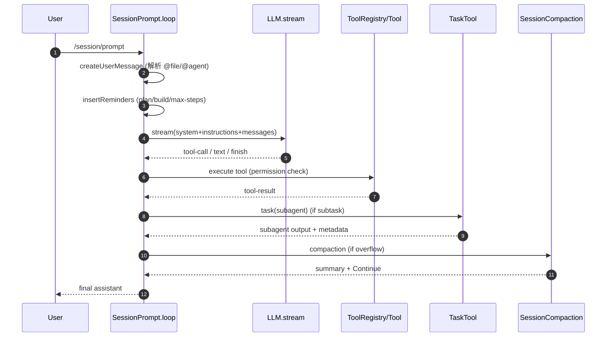

# OpenCode Prompt 工程与工作流分析（基于当前代码）

本文从“prompt 工程”视角，逐层拆解 OpenCode 在 **本项目当前实现**中的工作流、prompt 资产组织方式，以及多轮自主编码与多 agent 协作如何被工程化串联。所有结论均结合源码位置与行号，便于复核。

---

## 1. 端到端工作流（/session/prompt -> 结果返回）

**主入口**是 `SessionPrompt.prompt()`，完成“用户消息创建 → 主循环执行”。

1. **创建用户消息 + 权限兼容**
   - 入口：`SessionPrompt.prompt()` 处理 `PromptInput` 并写入 user message，兼容旧式 tools 权限字段。见 `packages/opencode/src/session/prompt.ts:152`。 
   - 兼容工具权限合并：`PermissionNext.Ruleset` 的临时转换在同一函数内。见 `packages/opencode/src/session/prompt.ts:159`。

2. **会话主循环（多轮自主执行）**
   - 核心 while-loop：`SessionPrompt.loop()` 会在工具调用、子任务、压缩、自动续写之间循环。见 `packages/opencode/src/session/prompt.ts:240`。
   - 当 `assistant.finish` 满足终止条件时结束循环，否则持续执行。见 `packages/opencode/src/session/prompt.ts:284`。

3. **LLM 调用与流式处理**
   - LLM 流式核心：`LLM.stream()` 负责系统 prompt 合成、参数/工具注入与 stream 处理。见 `packages/opencode/src/session/llm.ts:48`。
   - 流式解析与工具回写：`SessionProcessor.process()` 逐步解析 reasoning、tool-call、tool-result，推动多轮自主执行。见 `packages/opencode/src/session/processor.ts:45`。

4. **工具调用 + 权限**
   - 工具注册与过滤：`ToolRegistry.tools()` 按模型与配置筛选工具（例如 gpt-* 切换 apply_patch / edit/write）。见 `packages/opencode/src/tool/registry.ts:124`。
   - 权限拦截：每次工具执行通过 `PermissionNext.ask()` 进行规则评估。见 `packages/opencode/src/session/prompt.ts:687`。

5. **快照与差异**
   - `SessionProcessor` 在 `start-step/finish-step` 之间记录 snapshot 与 patch。见 `packages/opencode/src/session/processor.ts:227`。

---

## 2. Prompt 资产清单（真实文件映射）

### 2.1 系统 / 模型 Prompt（SystemPrompt）
系统 Prompt 根据模型 ID 选择不同模板：

- **gpt-5**：`packages/opencode/src/session/prompt/codex_header.txt:1`  
- **gpt-* / o1 / o3**：`packages/opencode/src/session/prompt/beast.txt:1`  
- **gemini-***：`packages/opencode/src/session/prompt/gemini.txt:1`  
- **claude***：`packages/opencode/src/session/prompt/anthropic.txt:1`  
- **default fallback**：`packages/opencode/src/session/prompt/qwen.txt:1`

选择逻辑见 `SystemPrompt.provider()`：`packages/opencode/src/session/system.ts:18`。

### 2.2 Plan/Build/Max Steps 提示
- **Plan 模式提醒**：`packages/opencode/src/session/prompt/plan.txt:1`
- **Plan→Build 切换提醒**：`packages/opencode/src/session/prompt/build-switch.txt:1`
- **最大步数提醒**：`packages/opencode/src/session/prompt/max-steps.txt:1`

### 2.3 Agent 专用 Prompt
内建 Agent 的专用 prompt 在 `packages/opencode/src/agent/prompt/`：
- `compaction`：`packages/opencode/src/agent/prompt/compaction.txt:1`
- `summary`：`packages/opencode/src/agent/prompt/summary.txt:1`
- `title`：`packages/opencode/src/agent/prompt/title.txt:1`
- `explore`：`packages/opencode/src/agent/prompt/explore.txt:1`

Agent 注册位置：`packages/opencode/src/agent/agent.ts:73`。

### 2.4 Command Prompt 模板（/init, /review 等）
- `/init` 模板：`packages/opencode/src/command/template/initialize.txt:1`
- `/review` 模板：`packages/opencode/src/command/template/review.txt:1`

Command 注册与模板注入：`packages/opencode/src/command/index.ts:58`。

### 2.5 每个 Prompt 的作用（逐文件说明）

#### 系统 / 模型 Prompt

| Prompt 文件 | 作用 | 触发条件 | 拼装位置 |
|---|---|---|---|
| `packages/opencode/src/session/prompt/codex_header.txt:1` | OpenCode 默认系统指令（编辑约束、工具策略、输出风格） | 模型 ID 含 `gpt-5` | `SystemPrompt.provider()` → `LLM.stream()` |
| `packages/opencode/src/session/prompt/beast.txt:1` | 强自治流程 + 严格工作流约束（深度计划、测试、WebFetch 等） | 模型 ID 含 `gpt-`/`o1`/`o3` | 同上 |
| `packages/opencode/src/session/prompt/gemini.txt:1` | Gemini 专用：工具与计划流程、输出约束、CLI 风格 | 模型 ID 含 `gemini-` | 同上 |
| `packages/opencode/src/session/prompt/anthropic.txt:1` | Claude 专用：安全约束、简洁输出、工具与任务管理 | 模型 ID 含 `claude` | 同上 |
| `packages/opencode/src/session/prompt/qwen.txt:1` | 回退系统 prompt（当模型不匹配上述规则） | 其余情况 | 同上 |

#### Plan / Build / Max-steps Prompt

| Prompt 文件 | 作用 | 触发条件 | 拼装位置 |
|---|---|---|---|
| `packages/opencode/src/session/prompt/plan.txt:1` | 强制“只读计划阶段”提示 | agent=plan 且 `OPENCODE_EXPERIMENTAL_PLAN_MODE=false` | `insertReminders()` |
| `packages/opencode/src/session/prompt/build-switch.txt:1` | 从 plan 切到 build 时的权限恢复提示 | 上一次 assistant 为 plan，本轮 agent=build | `insertReminders()` |
| `packages/opencode/src/session/prompt/max-steps.txt:1` | 达到 steps 限制后禁止再调用工具 | step >= agent.steps | `SessionPrompt.loop()` |

#### Agent Prompt（内部/子代理）

| Agent | Prompt 文件 | 作用 | 调用入口 |
|---|---|---|---|
| `explore` | `packages/opencode/src/agent/prompt/explore.txt:1` | 代码库搜索/定位专用子代理规则 | TaskTool 子 session |
| `compaction` | `packages/opencode/src/agent/prompt/compaction.txt:1` | 生成“续写提示”以压缩上下文 | `SessionCompaction.process()` |
| `summary` | `packages/opencode/src/agent/prompt/summary.txt:1` | 会话摘要（PR 风格） | `SessionSummary` |
| `title` | `packages/opencode/src/agent/prompt/title.txt:1` | 生成会话标题 | `ensureTitle()` |

#### Command Prompt 模板

| Command | Prompt 文件 | 作用 | 触发入口 |
|---|---|---|---|
| `/init` | `packages/opencode/src/command/template/initialize.txt:1` | 自动生成/更新 AGENTS.md 的指导模板 | `SessionPrompt.command()` |
| `/review` | `packages/opencode/src/command/template/review.txt:1` | 代码审查流程指令模板 | `SessionPrompt.command()` |

#### 工程级指令（非 .txt，但参与系统拼装）

| 指令来源 | 作用 | 触发条件 | 拼装位置 |
|---|---|---|---|
| `AGENTS.md` / `CLAUDE.md` | 项目级规范与偏好 | 自动向上查找 | `InstructionPrompt.system()` |
| config.instructions (文件/URL) | 额外系统指令 | 配置存在 | `InstructionPrompt.system()` |

---

## 3. Prompt 组装策略（多层合成）

### 3.1 System Prompt 的拼装顺序
`LLM.stream()` 拼装系统 prompt 的顺序如下：

1. **Agent Prompt**（若 agent 配置了 prompt，则优先）
2. **Provider Prompt**（按模型映射选择）
3. **运行环境**（Working directory、平台、日期等）
4. **工程级指令**（AGENTS.md / CLAUDE.md 等）
5. **用户本轮 system**（如果提供）

具体拼装见 `packages/opencode/src/session/llm.ts:69`，其中 SystemPrompt 来源：`packages/opencode/src/session/system.ts:18`。

### 3.2 环境信息注入
环境描述由 `SystemPrompt.environment()` 构造：`packages/opencode/src/session/system.ts:27`。包含 cwd、git 状态、平台、日期等信息，并包装为 `<env>` 区块。

### 3.3 工程级指令注入（AGENTS.md / CLAUDE.md）
- `InstructionPrompt.system()` 会查找项目内指令文件并合并。见 `packages/opencode/src/session/instruction.ts:43`。
- 查找顺序：项目内 `AGENTS.md` / `CLAUDE.md` / `CONTEXT.md`，再查全局或配置路径。见 `packages/opencode/src/session/instruction.ts:48`。
- 这些指令会被拼入 system prompt，并对所有后续调用生效。

### 3.4 用户 prompt 的“结构化拆分”
`SessionPrompt.resolvePromptParts()` 会解析用户文本中的 `@path` 与 `@agent` 片段（基于 `ConfigMarkdown.FILE_REGEX`），并生成 **File Part / Agent Part**：
- 解析正则位置：`packages/opencode/src/config/markdown.ts:5`
- Part 解析逻辑：`packages/opencode/src/session/prompt.ts:183`

#### 3.4.1 文件引用注入
当用户引用 `@file` 或 `@dir`：
- 系统会自动读取并插入“Read/List 工具调用”的 synthetic 内容（注入到 prompt）。
- 逻辑见 `SessionPrompt.createUserMessage()` 的 file 分支：`packages/opencode/src/session/prompt.ts:732`。

#### 3.4.2 Agent 引用注入（@agent）
当用户写 `@general` 或 `@explore`：
- 生成 `AgentPart`，随后追加一条 synthetic 文本，明确要求“调用 task 工具并指定 subagent”。见 `packages/opencode/src/session/prompt.ts:1139`。
- 该机制让用户显式选择子代理并跳过 `task` 权限确认。见 `packages/opencode/src/session/prompt.ts:555`。

### 3.5 Read Tool 的“系统提醒注入”
读取文件时，`ReadTool` 会把临近目录的指令文件追加为 `<system-reminder>`，保证“就近提示”随文件内容进入上下文：
- `InstructionPrompt.resolve()`：`packages/opencode/src/session/instruction.ts:140`
- `ReadTool.execute()` 追加提醒：`packages/opencode/src/tool/read.ts:140`

### 3.6 `<system-reminder>` 的作用与定位
`<system-reminder>` 是一种 **软系统提示**（soft system prompt）标记，用于把“约束/提醒”注入到模型上下文，但不占用 system role 的最高优先级。它主要出现在 **user message 或工具输出文本**里，让模型在保持 system prompt 稳定的前提下，获得额外运行时提醒。

主要来源与作用：

1. **Plan / Build 提示**（行为约束与流程提醒）  
   - 注入位置：`insertReminders()` 往 user message 里追加 `<system-reminder>`  
   - 作用：在计划模式强制只读或在 plan→build 切换时提示“允许修改”。  
   - 位置：`packages/opencode/src/session/prompt.ts:1203`（plan.txt 注入）与 `packages/opencode/src/session/prompt.ts:1215`（build-switch 注入）。

2. **排队用户消息的“继续提醒”**（防止忽略新指令）  
   - 注入位置：`SessionPrompt.loop()` 对上一次完成后新排队的用户消息包裹 `<system-reminder>`  
   - 作用：明确“请处理这条用户消息并继续任务”。  
   - 位置：`packages/opencode/src/session/prompt.ts:578`。

3. **ReadTool 的就近指令提醒**（目录级规范注入）  
   - 注入位置：`ReadTool.execute()` 在文件输出文本尾部追加 `<system-reminder>`  
   - 作用：把同目录的 `AGENTS.md / CLAUDE.md` 之类规范“就近”附带进入上下文。  
   - 位置：`packages/opencode/src/tool/read.ts:140`。

总结：`<system-reminder>` 让“流程/约束/规范”可以 **动态附加** 到用户与工具输出中，而不会破坏 system prompt 的稳定结构。

---

## 4. 多轮自主编码的工程化闭环

### 4.1 SessionPrompt.loop 的循环机制
循环中会优先消费 subtask、compaction，再进行正常 LLM 调用：
- 子任务优先：`packages/opencode/src/session/prompt.ts:314`
- Compaction 优先：`packages/opencode/src/session/prompt.ts:428`
- 正常 LLM 处理：`packages/opencode/src/session/prompt.ts:525`

### 4.2 “最大步数”强制收敛
- Agent 可配置 steps，当超过步数后插入 `max-steps.txt` 限制工具调用，仅允许文本回答。见 `packages/opencode/src/session/prompt.ts:607`。

### 4.3 规划 / 构建模式切换
- 计划模式提醒：`PROMPT_PLAN` 注入 user parts。见 `packages/opencode/src/session/prompt.ts:1203`。
- build 切换提醒：`BUILD_SWITCH` 注入（从 plan 进入 build）。见 `packages/opencode/src/session/prompt.ts:1215`。
- Flag 开启新 plan mode 时，将生成“计划文件”提示。见 `packages/opencode/src/session/prompt.ts:1250`。

### 4.4 流式处理与工具驱动
`SessionProcessor.process()` 负责流式解析与工具执行状态更新：
- reasoning / text / tool-call / tool-result / tool-error 处理。见 `packages/opencode/src/session/processor.ts:64`。
- “doom-loop” 保护：连续相同工具调用 3 次会触发额外权限确认。见 `packages/opencode/src/session/processor.ts:148`。

---

## 5. 多 Agent 协同的工程化实现

### 5.1 Agent 定义（角色与权限）
内置 agent：`build`、`plan`、`general`、`explore`、`compaction`、`title`、`summary`，以及用户自定义 agent。见 `packages/opencode/src/agent/agent.ts:73`。

### 5.2 子任务调度（TaskTool）
- `task` 工具创建子 Session，并限制子 agent 权限（默认禁用 todoread/todowrite）。见 `packages/opencode/src/tool/task.ts:62`。
- 子任务调用 `SessionPrompt.prompt()` 执行自身 prompt。见 `packages/opencode/src/tool/task.ts:147`。
- 子任务完成后返回 `<task_metadata>`（带 session_id），便于主任务追踪。见 `packages/opencode/src/tool/task.ts:178`。

### 5.3 多 Agent 调用来源
1. **用户显式 @agent** → `resolvePromptParts` 生成 AgentPart 并直接注入“调用 task 工具”指令。见 `packages/opencode/src/session/prompt.ts:1139`。
2. **命令触发 subtask** → `/review` 等命令会把模板构造成 `SubtaskPart`。见 `packages/opencode/src/session/prompt.ts:1691`。
3. **模型自主调用 task** → LLM 选择 task 工具，触发 TaskTool 执行。

---

## 6. Prompt 相关的“约束与安全边界”

### 6.1 权限与工具禁用
- `PermissionNext` 规则集决定 tool 是否 allow/deny/ask。见 `packages/opencode/src/permission/next.ts:110`。
- `LLM.resolveTools()` 会根据规则禁用工具。见 `packages/opencode/src/session/llm.ts:271`。

### 6.2 MCP 工具与输出截断
- MCP 工具被包装并附加 permission + truncate。见 `packages/opencode/src/session/prompt.ts:733`。
- 工具输出默认截断（Truncate.output）。见 `packages/opencode/src/tool/tool.ts:69`。

### 6.3 Context Overflow 与自动压缩
- overflow 判定：`SessionCompaction.isOverflow()`。见 `packages/opencode/src/session/compaction.ts:30`。
- 压缩 prompt 由 `compaction` agent 生成，并可插入自动“Continue”消息。见 `packages/opencode/src/session/compaction.ts:92`。

---

## 7. 多 Prompt 串联在本项目中的具体表现

| 串联阶段 | Prompt 来源 | 工程落点 | 说明 |
|---|---|---|---|
| System 基线 | `session/prompt/*.txt` | `SystemPrompt.provider()` | 不同模型套不同系统模板。 `packages/opencode/src/session/system.ts:18` |
| Project 指令 | `AGENTS.md / CLAUDE.md` | `InstructionPrompt.system()` | 自动注入项目规范。 `packages/opencode/src/session/instruction.ts:87` |
| 用户 prompt | 用户文本 + `@file/@agent` | `resolvePromptParts()` | 结构化拆分为 text/file/agent parts。 `packages/opencode/src/session/prompt.ts:183` |
| Plan / Build 切换 | `plan.txt` / `build-switch.txt` | `insertReminders()` | 根据 agent 状态注入提醒。 `packages/opencode/src/session/prompt.ts:1198` |
| 子任务 prompt | command 模板 / task | `TaskTool.execute()` | 子 session 执行独立 prompt。 `packages/opencode/src/tool/task.ts:41` |
| 压缩 prompt | `compaction` agent | `SessionCompaction.process()` | 生成续写提示，保留关键信息。 `packages/opencode/src/session/compaction.ts:92` |
| 总结/标题 | summary/title agent | `SessionSummary`/`ensureTitle` | 辅助会话摘要与标题。 `packages/opencode/src/session/prompt.ts:1746` |

---

## 8. 本项目 Prompt 工程的关键特征（总结）

1. **Prompt 多源拼装**：系统 + 项目指令 + 用户 + 工具输出合成，而非单一大 prompt。关键拼装点在 `LLM.stream()` 与 `InstructionPrompt.system()`。`packages/opencode/src/session/llm.ts:69`。
2. **多轮自主循环**：`SessionPrompt.loop()` 负责持续执行与收敛，结合工具与子任务实现“自动编码闭环”。`packages/opencode/src/session/prompt.ts:240`。
3. **工程化子 agent 协作**：通过 TaskTool + Subsession 形成并行/分工协作的 prompt 工程结构。`packages/opencode/src/tool/task.ts:23`。
4. **上下文可控**：通过 compaction、max-steps、truncation 形成“可控上下文预算”。`packages/opencode/src/session/compaction.ts:30` 与 `packages/opencode/src/session/prompt.ts:607`。
5. **规则与安全边界强约束**：PermissionNext + ToolRegistry + ReadTool 指令注入形成多层安全与规范约束。`packages/opencode/src/permission/next.ts:110`。

---

## 9. 你可以从哪里改 prompt 行为（工程落点）

- **改系统 prompt**：`packages/opencode/src/session/prompt/*.txt` + `SystemPrompt.provider()`。
- **改 agent prompt**：`packages/opencode/src/agent/prompt/*.txt`。
- **改项目指令**：在 repo 根部 `AGENTS.md`（会被 `InstructionPrompt.system()` 读入）。
- **改 command prompt**：`packages/opencode/src/command/template/*.txt` 或 config.command。
- **改 plan/build 机制**：`insertReminders()` 与 `Flag.OPENCODE_EXPERIMENTAL_PLAN_MODE`。

---

## 10. 附：OpenCode Prompt 运行序列图（基于源码）



---

## 11. 请求场景的完整 Prompt 组装实例（按实际拼装顺序）

本节给出 **真实工程中的“完整 prompt 拼装结构”**，用“组件原文 + 拼装顺序 + 结构化 message 列表”的方式呈现。为避免全文粘贴过长，系统 prompt 以“整段原文拼接”方式标注来源文件；这与实际执行完全一致（LLM 看到的是完整拼接结果）。

### 场景 A：普通 build 请求 + @file（无 @agent）

**用户输入**（示例）：
```
请优化 @packages/opencode/src/session/prompt.ts 中 insertReminders 的逻辑
```

**拼装结果（发送给模型的 messages 列表）**：
```
SYSTEM:
  [PROMPT_BEAST 全文]                               // packages/opencode/src/session/prompt/beast.txt:1
  + "\n" + [ENVIRONMENT 区块]                       // packages/opencode/src/session/system.ts:27
  + "\n" + [Instructions from: AGENTS.md 全文]      // packages/opencode/src/session/instruction.ts:87
  + "\n" + [user.system (如有)]                     // packages/opencode/src/session/llm.ts:78

USER:
  1) "请优化 @packages/opencode/src/session/prompt.ts 中 insertReminders 的逻辑"
  2) "Called the Read tool with the following input: {\"filePath\":\".../packages/opencode/src/session/prompt.ts\"}"
  3) "<file>...insertReminders 相关内容...</file>"
  4) (file part 附件：prompt.ts 的内容快照)
```

**关键来源与触发点**：
- `@file` 被解析为 File Part，并触发自动 read 注入。见 `packages/opencode/src/session/prompt.ts:732`。
- System 拼装遵循：Agent/Provider Prompt → 环境 → 指令 → user.system。见 `packages/opencode/src/session/llm.ts:69`。

---

### 场景 B：显式 @agent 子代理（@explore）

**用户输入**（示例）：
```
@explore 请找出本仓库里所有与 prompt 相关的入口与调用链
```

**主会话拼装结果**：
```
SYSTEM:
  [PROMPT_BEAST 或对应 provider prompt 全文]
  + "\n" + [ENVIRONMENT]
  + "\n" + [Instructions from: AGENTS.md]

USER:
  1) "@explore 请找出本仓库里所有与 prompt 相关的入口与调用链"
  2) (AgentPart: name=explore)
  3) "Use the above message and context to generate a prompt and call the task tool with subagent: explore"
```

**随后 LLM 调用 tool: task → 子 session prompt**：
```
SUB-SESSION SYSTEM:
  [PROMPT_EXPLORE 全文]                             // packages/opencode/src/agent/prompt/explore.txt:1
  + "\n" + [ENVIRONMENT]
  + "\n" + [Instructions from: AGENTS.md]

SUB-SESSION USER:
  1) "请找出本仓库里所有与 prompt 相关的入口与调用链"
```

**关键来源与触发点**：
- AgentPart 与“调用 task 工具指令”在 `createUserMessage()` 内生成。见 `packages/opencode/src/session/prompt.ts:1139`。
- 子任务通过 `TaskTool.execute()` 启动子 session，并复用 `SessionPrompt.prompt()`。见 `packages/opencode/src/tool/task.ts:147`。

---

### 场景 C：/review 命令触发 subtask（命令模板 + 子代理）

**用户输入**（示例）：
```
/review
```

**命令模板展开**（来自 `review.txt`）：
`packages/opencode/src/command/template/review.txt:1`（包含 git diff / status 等步骤说明）

**主会话拼装结果**（SubtaskPart）：
```
USER:
  1) (SubtaskPart)
     - agent: <review 默认 agent 或配置 agent>
     - prompt: [review.txt 模板内容 + 参数替换后文本]
```

**子 session prompt 结构**：
```
SYSTEM:
  [对应 provider prompt 全文]
  + "\n" + [ENVIRONMENT]
  + "\n" + [Instructions from: AGENTS.md]

USER:
  1) "You are a code reviewer. ... (review.txt 完整模板内容)"
```

**关键来源与触发点**：
- `command()` 将 template 解析为 SubtaskPart。见 `packages/opencode/src/session/prompt.ts:1691`。
- Subtask 优先处理（直接触发 TaskTool）。见 `packages/opencode/src/session/prompt.ts:314`。

---

### 场景 D：Plan 模式提示（计划阶段）

**用户输入**（示例）：
```
请先给出实现方案，不要改代码
```

**当 agent=plan 且 `OPENCODE_EXPERIMENTAL_PLAN_MODE=false` 时**：
```
USER:
  1) "请先给出实现方案，不要改代码"
  2) "<system-reminder> ... plan.txt 全文 ... </system-reminder>"
```

**当 `OPENCODE_EXPERIMENTAL_PLAN_MODE=true` 时**：
系统会注入“plan file 路径 + 分阶段流程”的长提醒（见 `packages/opencode/src/session/prompt.ts:1250`），并引导写 plan 文件。

---

### 说明：System 拼装是“单条拼接”而非多条 system message

`LLM.stream()` 会把 **Agent Prompt / Provider Prompt / environment / instructions / user.system** 拼成 **同一条 system 消息**（除非被插件拆分）。见 `packages/opencode/src/session/llm.ts:69`。因此，完整组装在实际模型输入中是“一个 system block + 多条 user/assistant message”。

---

### 场景 E：Claude 模型的完整拼装过程（实例）

**前提条件**：
- provider.modelID 包含 `claude`，触发 `PROMPT_ANTHROPIC`。见 `packages/opencode/src/session/system.ts:23`  
- 非 Codex OAuth 模式（Claude 默认是 system role 注入）  

**用户输入（示例）**：
```
请解释 @packages/opencode/src/session/prompt.ts:1200 附近的 plan/build 切换逻辑
```

**Claude 的实际拼装结构**（发送给模型的 messages 列表）：
```
SYSTEM:
  [PROMPT_ANTHROPIC 全文]                          // packages/opencode/src/session/prompt/anthropic.txt:1
  + "\n" + [ENVIRONMENT 区块]                      // packages/opencode/src/session/system.ts:27
  + "\n" + [Instructions from: AGENTS.md 全文]     // packages/opencode/src/session/instruction.ts:87
  + "\n" + [user.system (如有)]                    // packages/opencode/src/session/llm.ts:78

USER:
  1) "请解释 @packages/opencode/src/session/prompt.ts:1200 附近的 plan/build 切换逻辑"
  2) "Called the Read tool with the following input: {\"filePath\":\".../packages/opencode/src/session/prompt.ts\"}"
  3) "<file>...包含 insertReminders 与 plan/build 切换代码片段...</file>"
  4) (file part 附件：prompt.ts 的内容快照)
```

**关键流程说明**：
- Claude 使用 system role 注入（非 Codex OAuth）。见 `packages/opencode/src/session/llm.ts:236`。  
- Provider prompt 选择 `anthropic.txt`，再拼接 environment + instructions。见 `packages/opencode/src/session/llm.ts:69`。  
- `@file` 引用会自动触发 read 注入，作为 user message 的 synthetic parts。见 `packages/opencode/src/session/prompt.ts:732`。
