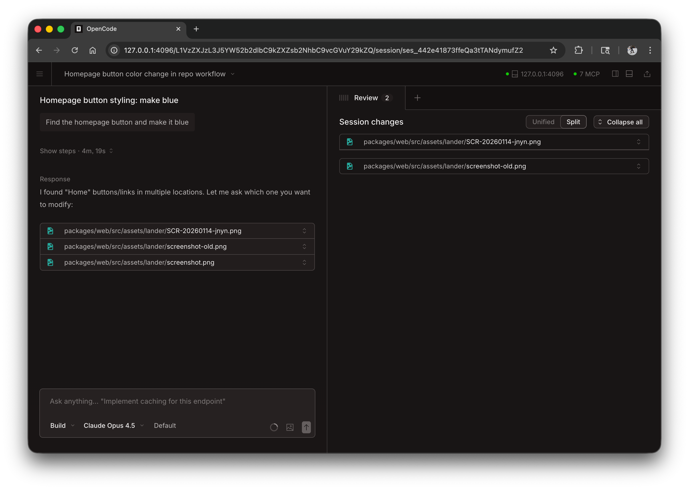

OpenCode 可以在浏览器中作为 Web 应用运行，无需终端也能获得同样强大的 AI 编程体验。


## 入门

运行以下命令启动 Web 界面：

```bash
opencode web
```

这会在 `127.0.0.1` 上启动一个本地服务器，随机选择可用端口，并自动在默认浏览器中打开 OpenCode。

:::caution
如果未设置 `OPENCODE_SERVER_PASSWORD`，服务器将不会受保护。本地使用没有问题，但进行网络访问时应设置该变量。
:::

---

## 配置

你可以使用命令行参数或在[配置文件](/docs/config)中配置 Web 服务器。

### 端口

默认情况下，OpenCode 会选择一个可用端口。你也可以指定端口：

```bash
opencode web --port 4096
```

### 主机名

默认情况下，服务器绑定在 `127.0.0.1`（仅本机）。要让 OpenCode 在你的网络中可访问：

```bash
opencode web --hostname 0.0.0.0
```

使用 `0.0.0.0` 时，OpenCode 会同时显示本地和网络地址：

```
  Local access:       http://localhost:4096
  Network access:     http://192.168.1.100:4096
```

### mDNS 发现

启用 mDNS 以便在本地网络中发现你的服务器：

```bash
opencode web --mdns
```

这会自动将主机名设为 `0.0.0.0`，并将服务器广播为 `opencode.local`。

### CORS

允许额外域名的 CORS（适用于自定义前端）：

```bash
opencode web --cors https://example.com
```

### 认证

要保护访问权限，请使用 `OPENCODE_SERVER_PASSWORD` 环境变量设置密码：

```bash
OPENCODE_SERVER_PASSWORD=secret opencode web
```

用户名默认为 `opencode`，可以用 `OPENCODE_SERVER_USERNAME` 修改。

---

## 使用 Web 界面

启动后，Web 界面会提供对 OpenCode 会话的访问。

### 会话

在首页查看并管理会话。你可以看到活动会话并创建新会话。



### 服务器状态

点击 "See Servers" 查看已连接的服务器及其状态。


---

## 连接终端

你可以将终端 TUI 连接到运行中的 Web 服务器：

```bash
# Start the web server
opencode web --port 4096

# In another terminal, attach the TUI
opencode attach http://localhost:4096
```

这允许你同时使用 Web 界面与终端，共享相同的会话与状态。

---

## 配置文件

你也可以在 `opencode.json` 配置文件中设置服务器参数：

```json
{
  "server": {
    "port": 4096,
    "hostname": "0.0.0.0",
    "mdns": true,
    "cors": ["https://example.com"]
  }
}
```

命令行参数的优先级高于配置文件设置。
